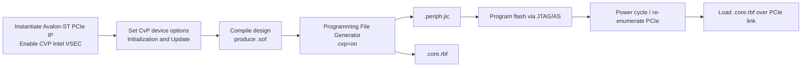

# CvP with Avalon-ST: Peripheral Image Guide

This guide describes how to build, split, and program a **Configuration via Protocol (CvP)**
periphery image using the **Avalon® Streaming (Avalon-ST)** PCIe hard IP interface. It
focuses on the static `.periph.jic` image that must be stored in on-board flash before the
host can download the reconfigurable `.core.rbf` over PCIe.

## What CvP splits

CvP partitions one full bitstream into two images:

| Image | File | Contents | Storage |
| --- | --- | --- | --- |
| Periphery | `*.periph.jic` | PCIe hard IP, transceivers, I/O, clocks, and other static periphery logic | On-board QSPI/AS flash |
| Core | `*.core.rbf` | FPGA fabric (LABs, M20K/MLAB, DSP, and other CRAM-controlled logic) | Host memory, loaded over PCIe |

The periphery image is static. After you program it to flash, you can update only the core
image without reprogramming flash, as long as the new core image remains compatible with the
existing periphery image.

## Why Avalon-ST for CvP

For CvP initialization, instantiate one of the **Avalon Streaming** PCIe IP cores (not the
memory-mapped variant):

- **Agilex 7:** P-Tile, R-Tile, or F-Tile Avalon® Streaming IP for PCI Express®
- **Stratix 10:** P-Tile Avalon® Streaming IP for PCI Express®
- **Older families (Arria V / Cyclone V / Stratix V):** Hard IP for PCI Express with
  Avalon-ST application interface

The CvP PCIe endpoint must live in the static periphery region. Enabling CvP in the Avalon-ST
PCIe IP tells Quartus® Prime to place the endpoint in the required hard IP location and to
generate separate periphery and core programming files at conversion time.

> **Note:** Agilex 5 uses the GTS AXI Streaming IP for PCIe. The CvP flow is the same
> conceptually, but the IP name and some GUI tabs differ. This guide uses Agilex 7
> Avalon-ST terminology; adapt IP names for your device family.

## Design flow overview



## Step 1: Generate Avalon-ST PCIe IP with CvP enabled

1. Open **Quartus® Prime Pro Edition**.
2. On the **Tools** menu, click **Platform Designer**.
3. Create a new system and add the tile-appropriate Avalon-ST PCIe IP:
   - P-Tile: **P-Tile Avalon® Streaming IP for PCI Express®**
   - R-Tile: **R-Tile Avalon® Streaming IP for PCI Express®**
   - F-Tile: **F-Tile Avalon® Streaming IP for PCI Express®**
4. On **Top-Level Settings**, enable **Enable CVP (Intel VSEC)**.

   This option is required when using the Altera CvP driver or the Linux FPGA manager flow.

5. Configure PCIe link parameters (Gen, lane width, BARs, and so on) for your board.

6. **Dual x8 mode only:** If you use PCIe 3.0 2x8 or PCIe 4.0 2x8:
   - On **PCIe 0 Settings**, leave **Device ID** at `0x00000000`.
   - On **PCIe 1 Settings**, set **Device ID** to a non-zero value.
   - Only **Port 0** can be used for CvP; the driver registers Port 0 when its Device ID is zero.

7. On **Example Designs**, select **Synthesis** (and **Simulation** if needed), then click
   **Generate Example Design**. Open the generated `pcie_ed.qpf` project or integrate the
   generated IP into your own top-level design.

8. Assign PCIe refclk, PERST#, and lane pins to the correct transceiver bank. CvP requires
   the hard PCIe block pins to match the IP tile you selected.

## Step 2: Configure CvP in Device and Pin Options

1. On the **Assignments** menu, click **Device**.
2. Under **Configuration**:
   - Set **Configuration scheme** to **Active Serial x4 (can use Configuration Device)**.
   - Open **Configuration Pin Options** and enable:
     - **USE CONF_DONE output**
     - **USE CVP_CONFDONE output**
   - Assign `CONF_DONE` and `CVP_CONFDONE` to the appropriate SDM I/O pins.
3. Under **CvP Settings**, set **Configuration via Protocol** to **Initialization and update**.
4. Set the AS clock source to **166 MHz** (with a 25 MHz, 100 MHz, or 125 MHz configuration
   clock source under **General**, per your board crystal).

## Step 3: Compile the design

Run a full compilation to produce `output_files/<top>.sof`.

```text
Processing → Start Compilation
```

Resolve any pin, timing, or PCIe placement errors before continuing. CvP designs must use the
CMU/transceiver PLL and hard reset controller required by the PCIe hard IP.

## Step 4: Generate the periphery and core images

### GUI: Programming File Generator

1. On the **Tools** menu, open **Programming File Generator**.
2. On **Output files**, select:
   - **JTAG Indirect Configuration File for Periphery Configuration (.jic)**
   - **Raw Binary File for CvP Core Configuration (.rbf)**
3. On **Input files**, add your compiled `.sof`.
4. On **Configuration device**, add your QSPI flash part and create a partition for the
   `.sof` input (Address Mode: **Auto**).
5. Generate the files. Quartus produces:
   - `<name>.periph.jic` — program this to flash
   - `<name>.core.rbf` — load this over PCIe after link up

### Command line: `quartus_pfg`

Use the helper script in `scripts/generate_cvp_images.sh`, or run `quartus_pfg` directly:

```bash
quartus_pfg -c output_files/top.sof output_files/top.jic \
  -o device=MT25QU128 \
  -o flash_loader=AGFB014R24AR0 \
  -o mode=ASX4 \
  -o cvp=on
```

Replace `device` and `flash_loader` with values for your board. The `flash_loader` value is
typically a prefix of your FPGA part number. Use the Programming File Generator GUI once to
discover valid options, then save a `.pfg` file for repeatable builds:

```bash
quartus_pfg -c saved_settings.pfg
```

### Output file summary

| File | Purpose |
| --- | --- |
| `*.periph.jic` | Static periphery image for QSPI/AS flash |
| `*.core.rbf` | Reconfigurable core fabric image for PCIe download |
| `*.map` (optional) | Memory map for third-party programmers |
| `*.rpd` (optional) | Raw flash data for third-party programmers |

## Step 5: Program the periphery image to flash

1. Connect JTAG to the FPGA.
2. Open **Quartus® Prime Programmer**.
3. Add your Agilex/Stratix device and the configuration flash device.
4. Assign `*.periph.jic` to the flash device.
5. Click **Start** to program flash.
6. **Power-cycle** the FPGA card and host so the new periphery image loads and PCIe
   re-enumerates.

Verify the link:

```bash
lspci -d 1172:   # Altera/Intel vendor ID; adjust for your Device ID
```

The endpoint should report the expected link speed and width before you load the core image.

## Step 6: Load the core image over PCIe

After the periphery image is active and the PCIe link is in L0:

### Linux (FPGA manager)

```bash
cp top.core.rbf /lib/firmware/
echo top.core.rbf > /sys/kernel/debug/fpga_manager/fpga0/firmware_name
dmesg | tail
```

### Linux (Altera CvP driver)

```bash
cp top.core.rbf /lib/firmware/
echo top.core.rbf > /dev/altera_cvp
```

### Windows / legacy flow

```bash
quartus_cvp --vid=1172 --did=<device_id> top.core.rbf
```

Use the Vendor ID and Device ID from your PCIe IP **Device Identification Registers** tab.

### Verify CvP completion

- `CVP_CONFDONE` (or `CVP_DONE` status register) should assert high after a successful core load.
- Your application logic in the core region should begin operating.
- Re-loading a new `.core.rbf` does not require reprogramming flash, as long as the core
  remains compatible with the programmed periphery image.

## Compatibility rules for core updates

When you ship multiple core revisions against one programmed periphery image:

- Do not change PCIe hard IP parameters (Vendor ID, Device ID, BAR layout, lane width).
- Do not move or remove the CvP-enabled Avalon-ST PCIe endpoint from the static region.
- Keep transceiver and refclk pin assignments identical.
- For a new periphery revision, reprogram flash and power-cycle before deploying new cores.

## Troubleshooting

| Symptom | Likely cause | Action |
| --- | --- | --- |
| No `.periph.jic` after conversion | CvP not enabled in device options or PCIe IP | Enable **Initialization and update** and **Enable CVP (Intel VSEC)** |
| PCIe link does not train | Wrong periphery image, refclk, or PERST# | Reprogram flash; verify pin assignments |
| Core load fails | VID/DID mismatch, driver not bound, or incompatible core | Match `quartus_cvp` IDs; check `dmesg` |
| `CVP_CONFDONE` stays low | Core image built against different periphery revision | Rebuild core from the same `.sof` split as the programmed periphery |
| Dual-port x8: wrong port used for CvP | Port 1 has Device ID 0 | Set Port 0 Device ID to `0x00000000` only |

## References

- [Agilex 7 CvP Implementation User Guide](https://docs.altera.com/r/docs/683763/23.1/agilextm-7-device-configuration-via-protocol-cvp-implementation-user-guide/)
- [Agilex 5 CvP Implementation User Guide](https://docs.altera.com/r/docs/813775/25.1/configuration-via-protocol-cvp-implementation-user-guide-agilextm-5-fpgas-and-socs/)
- [P-Tile Avalon Streaming IP for PCIe User Guide](https://www.intel.com/content/www/us/en/docs/programmable/683517/current/p-tile-avalon-streaming-ip-for-pcie-user-guide.html)
- [Creating Configuration Files from Command Line (`quartus_pfg`)](https://docs.altera.com/r/docs/683847/26.1/stratix-10-soc-fpga-boot-user-guide/creating-configuration-files-from-command-line)
