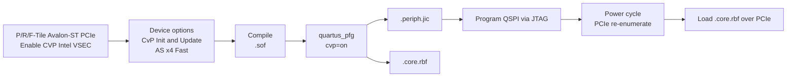

# Agilex™ 7 CvP: Avalon-ST Peripheral Image Guide

This guide covers **Configuration via Protocol (CvP) Initialization** on **Agilex™ 7**
FPGAs using the **Avalon® Streaming (Avalon-ST)** PCIe hard IP. Focus is the static
periphery image (`*.periph.jic`) that must be programmed to on-board QSPI flash before the
host can download the core image (`*.core.rbf`) over PCIe.

Primary reference: [Agilex 7 Device CvP Implementation User Guide](https://docs.altera.com/r/docs/683763/23.1/agilextm-7-device-configuration-via-protocol-cvp-implementation-user-guide/).

## Agilex 7 CvP images

CvP splits one compiled bitstream into two images:

| Image | File | Contents (Agilex 7) | Storage |
| --- | --- | --- | --- |
| Periphery | `*.periph.jic` | CvP PCIe hard IP core only (static; not reconfigurable) | On-board QSPI via AS x4 |
| Core | `*.core.rbf` | Entire device except the CvP PCIe core | Host memory, loaded over PCIe |

- Recommended QSPI size for the periphery image: **≤ 128 Mb**.
- Core image size must not exceed the Agilex 7 configuration bitstream size in the device
  datasheet.
- After the periphery image is in flash, you can update only the core image without
  reprogramming flash, as long as the new core remains compatible with that periphery.

## Avalon-ST PCIe IP for Agilex 7

Instantiate the tile that matches your device series. Use the **Avalon Streaming** IP (not
Avalon-MM / MCDMA):

| Tile | IP Catalog name | Typical Agilex 7 series |
| --- | --- | --- |
| P-Tile | **P-Tile Avalon® Streaming IP for PCI Express®** | F-Series / I-Series with P-Tile |
| R-Tile | **R-Tile Avalon® Streaming IP for PCI Express®** | I-Series with R-Tile |
| F-Tile | **F-Tile Avalon® Streaming IP for PCI Express®** | F-Series / I-Series with F-Tile |

### CvP enable per tile

| Tile | Where to enable CvP |
| --- | --- |
| P-Tile | **Top-Level Settings** → **Enable CVP (Intel VSEC)** |
| R-Tile | **Top-Level Settings** → **Enable CVP (Intel VSEC)** |
| F-Tile | **PCIe0 Settings → PCIe0 PCI Express / PCI Capabilities → PCIe0 VSEC** → **Enable CVP (Intel VSEC)** |

### Port / lane rules

- CvP uses **Port 0** only.
- For Gen3/Gen4 **x16**, Port 0 (lanes 0–15) supports CvP.
- For Gen3/Gen4 **x8**, only Port 0 (lanes 0–7) supports CvP; Port 1 does not.
- For **PCIe 3.0 2x8** or **PCIe 4.0 2x8**:
  - PCIe 0 **Device ID** = `0x00000000`
  - PCIe 1 **Device ID** = non-zero
  - The Altera CvP driver registers Port 0 when Device ID is zero.

> **Note:** P-Tile Avalon-MM is not available from Quartus® Prime 21.2 onward. For
> Avalon-MM style applications use the MCDMA-based PCIe Avalon-MM IP; for this CvP
> periphery flow, use Avalon-ST as shown above.

## Design flow



## Step 1: Generate Avalon-ST PCIe IP with CvP enabled

1. Open **Quartus® Prime Pro Edition** and create or open your Agilex 7 project.
2. **Tools → Platform Designer**. Create a new system (or edit an existing one).
3. Delete the default `clock_in` / `reset_in` components if starting fresh.
4. From the IP Catalog, add your tile’s Avalon-ST PCIe IP (table above).
5. Set PCIe parameters (Gen, width, BARs, Device ID / Vendor ID) for your board.
6. Enable **Enable CVP (Intel VSEC)** on the tab for your tile (table above).
7. On **Example Designs**, select **Synthesis** (and **Simulation** if needed). Generated
   file format is Verilog only.
8. Click **Generate Example Design**, then open `pcie_ed.qpf` or integrate the IP into
   your top-level design.
9. Assign pins for the selected PCIe hard block:
   - PCIe refclk
   - `PERST#`
   - Transceiver lanes for the correct tile (bottom-left / top-left as required)
   - Do not move the hard IP pin allocation; lane reversal / polarity inversion on the PCB
     are supported by the IP.

For devices with two PCIe hard IP blocks on the left side, CvP can use either the lower or
upper block — pin assignments must match the block you chose.

## Step 2: Agilex 7 CvP device and pin options

**Assignments → Device → Device and Pin Options**

### Configuration

| Setting | Value |
| --- | --- |
| Configuration scheme | **Active Serial x4 (can use Configuration Device)** |
| Active serial clock source | **166 MHz** |
| Configuration clock source (General) | **25 MHz**, **100 MHz**, or **125 MHz** (board OSC) |

**Configuration Pin Options:**

- Enable **USE CONF_DONE output** and **USE CVP_CONFDONE output**.
- Assign both to SDM I/O pins.
- Prefer **SDM_IO16** for `CONF_DONE`. If you use another SDM I/O (except SDM_IO0 /
  SDM_IO16), add an external **4.7 kΩ** pull-down on that pin.

### CvP Settings

| Setting | Value |
| --- | --- |
| Configuration via Protocol | **Initialization and update** |

### Board MSEL (required for CvP Init)

Set the Agilex 7 `MSEL[2:0]` straps for **Active Serial x4 Fast mode**:

| Configuration scheme | MSEL[2:0] |
| --- | --- |
| AS x4 Fast (CvP Init) | **001** |

AS x4 Fast provides the shortest POR delay so the PCIe link can train within the PCIe
timing window. Total power-supply ramp (`tRAMP`) must be **&lt; 10 ms**.

## Step 3: Compile

```text
Processing → Start Compilation
```

Output: `output_files/<top>.sof`. Fix PCIe placement, pin, and timing errors before
continuing.

## Step 4: Generate `.periph.jic` and `.core.rbf`

### GUI: Programming File Generator

1. **Tools → Programming File Generator**.
2. **Output files:**
   - **JTAG Indirect Configuration File for Periphery Configuration (.jic)**
   - **Raw Binary File for CvP Core Configuration (.rbf)**
   - Optionally `.map` / `.rpd` for third-party flash tools
3. **Input files:** Add Bitstream → select your `.sof`.
4. **Configuration device:**
   - **Add Device** → select your QSPI part
   - **Add Partition** → Input file = your `.sof`, Address Mode = **Start** or **Auto**
   - **Select** flash loader → Device family **Agilex** → pick your FPGA part
5. Generate. Expected outputs:
   - `<name>.periph.jic`
   - `<name>.core.rbf`

### Command line: `quartus_pfg`

```bash
# Example: Agilex 7 F-Series flash loader prefix + 128 Mb QSPI
QSPI_DEVICE=MT25QU128 FLASH_LOADER=AGFB014R24AR0 \
  ./scripts/generate_cvp_images.sh output_files/top.sof output_files/top
```

Or directly:

```bash
quartus_pfg -c output_files/top.sof output_files/top.jic \
  -o device=MT25QU128 \
  -o flash_loader=AGFB014R24AR0 \
  -o mode=ASX4 \
  -o cvp=on
```

| Parameter | Description |
| --- | --- |
| `device` | On-board QSPI part (e.g. `MT25QU128`) |
| `flash_loader` | Agilex 7 FPGA part prefix used as the JIC helper image (from Programming File Generator → Select Devices → Agilex) |
| `mode` | `ASX4` |
| `cvp` | `on` — produces `.periph.jic` + `.core.rbf` |

Save a `.pfg` from the GUI once for your board, then reuse:

```bash
PFG_SETTINGS=board_cvp.pfg ./scripts/generate_cvp_images.sh output_files/top.sof
```

### Example flash_loader values (Agilex 7)

`flash_loader` is typically the alphanumeric prefix of your FPGA OPN. Confirm in the GUI
for your exact part:

| Device example | Typical `flash_loader` style |
| --- | --- |
| Agilex 7 F-Series (e.g. AGFB014…) | `AGFB014R24AR0` (example) |
| Other Agilex 7 OPNs | Prefix matching your selected device in Programming File Generator |

## Step 5: Program the periphery image

1. Install the Agilex 7 PCIe card in the DUT host and power on.
2. Open **Quartus® Prime Programmer** → **Auto Detect**.
3. Select the **Agilex™ 7** device → Change File → open `*.periph.jic`.
4. Check **Program/Configure** for the FPGA and the QSPI flash.
5. Click **Start**.
6. **Power-cycle** the FPGA card and host so AS x4 loads the new periphery and PCIe
   re-enumerates.

Verify link training before loading the core:

```bash
lspci -nn | grep -i 1172   # Altera/Intel VID; use your Device ID if different
```

Confirm expected Gen and lane width (RW Utilities or `lspci -vv`).

## Step 6: Load the core image over PCIe

### Linux FPGA manager

```bash
sudo ./scripts/load_cvp_core.sh top.core.rbf
# or manually:
sudo cp top.core.rbf /lib/firmware/
echo top.core.rbf | sudo tee /sys/kernel/debug/fpga_manager/fpga0/firmware_name
dmesg | tail
```

### Linux Altera CvP driver (`/dev/altera_cvp`)

```bash
sudo cp top.core.rbf /lib/firmware/
echo top.core.rbf | sudo tee /dev/altera_cvp
```

### Verify success

- `CVP_CONFDONE` / `CVP_DONE` asserts high.
- `dmesg` shows successful CvP completion.
- Application logic in the core fabric runs.

## Core-update compatibility (same periphery)

Keep these fixed across core revisions that share one programmed `.periph.jic`:

- Avalon-ST PCIe tile and **Enable CVP (Intel VSEC)**
- Vendor ID, Device ID, BAR map, link width / Gen
- PCIe hard-block and transceiver pin assignments
- CvP device options (**Initialization and update**, AS x4)

A new periphery revision requires reprogramming QSPI and a power cycle.

## Troubleshooting (Agilex 7)

| Symptom | Likely cause | Action |
| --- | --- | --- |
| No `.periph.jic` | CvP not enabled in IP or device options | Enable **CVP (Intel VSEC)** and **Initialization and update** |
| PCIe does not train after flash program | Wrong MSEL, AS clock, or periphery | Set MSEL=`001` (AS x4 Fast); verify AS clock 166 MHz; reprogram `.periph.jic` |
| Link late / host timeout | Power ramp too slow | Ensure `tRAMP` &lt; 10 ms; use AS x4 Fast |
| Core load fails | Driver / VID-DID / wrong port | Use Port 0; match Device ID; check `dmesg` |
| `CVP_CONFDONE` stays low | Core from different periphery build | Rebuild and re-split from the same `.sof` as the flashed periphery |
| Dual x8: CvP on wrong port | Port 1 Device ID is 0 | Port 0 Device ID must be `0x00000000` only |

## References

- [Agilex 7 Device CvP Implementation User Guide](https://docs.altera.com/r/docs/683763/23.1/agilextm-7-device-configuration-via-protocol-cvp-implementation-user-guide/)
- [Agilex 7 Configuration User Guide](https://docs.altera.com/r/docs/683673/26.1/agilextm-7-configuration-user-guide/)
- [P-Tile Avalon Streaming IP for PCIe User Guide](https://docs.altera.com/r/docs/683059/25.3/p-tile-avalon-streaming-ip-for-pci-express-user-guide/)
- [R-Tile Avalon Streaming IP for PCIe User Guide](https://www.intel.com/content/www/us/en/docs/programmable/683501/current/r-tile-avalon-streaming-intel-fpga-ip-for-pcie.html)
- [F-Tile Avalon Streaming IP for PCIe User Guide](https://docs.altera.com/r/docs/683140/25.3/f-tile-avalon-streaming-ip-for-pci-express-user-guide/)
- [`quartus_pfg` command-line configuration files](https://docs.altera.com/r/docs/683847/26.1/stratix-10-soc-fpga-boot-user-guide/creating-configuration-files-from-command-line)
